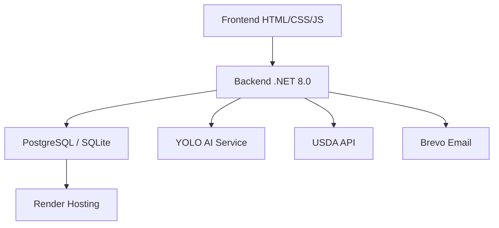

# Guia do Desenvolvedor BSFM

Bem-vindo ao Guia do Desenvolvedor do **BSFM (Brazilian System of Food Metric)**. Esta documentação fornece informações técnicas sobre a arquitetura, tecnologias, APIs e processos de desenvolvimento do protótipo.

---

## Arquitetura do Sistema

### Visão Geral

O BSFM segue uma arquitetura monolítica baseada em **.NET 8.0** com frontend servido estaticamente:



### Stack Tecnológico

#### Backend (.NET 8.0)
- **Framework:** ASP.NET Core 8.0
- **Banco de Dados:** PostgreSQL (produção) / SQLite (desenvolvimento)
- **ORM:** Entity Framework Core 8.0 com Code-First
- **Autenticação:** BCrypt.Net-Next para hash de senhas + tokens de verificação
- **Email:** MailKit + MimeKit + Brevo API
- **IA:** YoloDotNet + ONNX Runtime para análise de alimentos

#### Frontend
- **Framework CSS:** Tailwind CSS 3.0 (via CDN)
- **Fontes:** Google Fonts (Inter + Outfit)
- **Ícones:** Font Awesome 6.4.0
- **Gráficos:** Chart.js
- **Mapas:** Leaflet.js
- **Design System:** Glassmorphism + Gradientes

#### APIs Externas
- **USDA FoodData Central API** - Dados nutricionais
- **Brevo API** - Serviços de email transacional
- **YOLO Object Detection** - Reconhecimento de alimentos

---

## Setup Local

### Pré-requisitos

1. **.NET 8.0 SDK** - [Download oficial](https://dotnet.microsoft.com/download)
2. **PostgreSQL 15+** ou **SQLite** para desenvolvimento
3. **Visual Studio 2022** ou **VS Code** com extensão C#
4. **Git** para controle de versão

### Configuração do Ambiente

```bash
# 1. Clone o repositório
git clone <url-do-repositorio>
cd pim-03semestre-ads

# 2. Restaure as dependências
dotnet restore

# 3. Configure variáveis de ambiente
set USDA_API_KEY=sua_chave_aqui
set BREVO_API_KEY=sua_chave_aqui
set DATABASE_URL=Host=localhost;Database=bsfm_dev;Username=bsfm_user;Password=senha

# 4. Execute a aplicação
dotnet run
```

### Estrutura do Projeto

```
MobileRepositorio/
├── Controllers/
│   ├── PlanoAlimentarController.cs
│   ├── UsuarioController.cs
│   └── AnaliseIAController.cs
├── Models/
│   ├── Usuario.cs
│   ├── AnaliseIA.cs
│   ├── bsfmv1_yolo_final.onnx
│   └── yolov10n.onnx
├── Services/
│   ├── LimpezaAnalisesServices.cs
│   ├── OcrNutricionalService.cs
│   ├── UsdaNutritionService.cs
│   └── YoloInferenceService.cs
├── wwwroot/
│   ├── analisador-ia.html
│   ├── dashboard.html
│   ├── diario.html
│   ├── hospitais.html
│   ├── index.html
│   ├── libras.html
│   ├── login.html
│   ├── metas.html
│   └── planos.html
├── ClassesBSFM.cs
├── PonteDB.cs
├── Program.cs
└── MeusApp.csproj
```

---

## Inteligência Artificial

### Modelo YOLO

O BSFM utiliza um modelo YOLO (You Only Look Once) para detecção de alimentos:

```csharp
public class YoloInferenceService
{
    private readonly Yolo _yolo;
    
    public YoloInferenceService()
    {
        var modelPath = Path.Combine("Models", "bsfmv1_yolo_final.onnx");
        _yolo = new Yolo(modelPath);
    }
    
    public List<DetectionResult> AnalyzeImage(IFormFile image)
    {
        using var stream = image.OpenReadStream();
        var results = _yolo.Predict(stream);
        
        return results.Select(r => new DetectionResult
        {
            Label = r.Label,
            Confidence = r.Confidence,
            BoundingBox = r.BoundingBox
        }).ToList();
    }
}
```

### Fluxo de Análise Nutricional

1. **Upload da imagem** do prato pelo usuário
2. **Detecção YOLO** dos alimentos presentes
3. **Tradução EN → PT** dos alimentos identificados
4. **Consulta USDA API** para dados nutricionais
5. **Cálculo por porção** baseado no tamanho selecionado
6. **Persistência** no banco de dados
7. **Retorno dos resultados** ao usuário

---

## API Reference

### Autenticação

#### `POST /solicitar-codigo`
Solicita código de verificação para cadastro.

**Request:**
```json
{
  "email": "usuario@exemplo.com"
}
```

**Response:**
```json
{
  "sucesso": true,
  "mensagem": "Código enviado para o email"
}
```

#### `POST /cadastrar-usuario-final`
Cadastra um novo usuário.

**Request:**
```json
{
  "nome": "João Silva",
  "email": "joao@exemplo.com",
  "senha": "SenhaSegura123",
  "codigo": "123456",
  "aceitaTermos": true
}
```

### Análise Nutricional

#### `POST /analisar-prato`
Analisa uma imagem de prato usando IA.

**Request (multipart/form-data):**
- `foto`: Arquivo de imagem (jpg, png)
- `porcao`: "pequeno", "medio", "grande"
- `usuarioId`: ID do usuário

**Response:**
```json
{
  "sucesso": true,
  "analise": {
    "id": 123,
    "alimentos": [
      {
        "nome": "arroz",
        "quantidade": "100g",
        "calorias": 130,
        "proteinas": 2.7,
        "carboidratos": 28.2,
        "gorduras": 0.3
      }
    ]
  }
}
```

---

## Deploy no Render

### Arquivos de Configuração

O projeto inclui:

- **render.yaml**: Configuração Infrastructure as Code
- **Dockerfile**: Containerização da aplicação
- **Program.cs**: Configurado para ambiente de produção

### Variáveis de Ambiente Necessárias

```bash
# Banco de dados
DATABASE_URL=Host=...;Database=bsfm_prod;Username=bsfm_user;Password=...

# APIs externas
USDA_API_KEY=sua_chave_usda
BREVO_API_KEY=sua_chave_brevo

# Configuração da aplicação
ASPNETCORE_ENVIRONMENT=Production
```

### Health Check Endpoint

```csharp
[ApiController]
[Route("health")]
public class HealthController : ControllerBase
{
    private readonly PonteDB _db;
    
    public HealthController(PonteDB db)
    {
        _db = db;
    }
    
    [HttpGet]
    public async Task<IActionResult> Get()
    {
        try
        {
            await _db.Database.CanConnectAsync();
            return Ok(new 
            {
                status = "healthy",
                timestamp = DateTime.UtcNow,
                database = "connected"
            });
        }
        catch (Exception ex)
        {
            return StatusCode(503, new 
            {
                status = "unhealthy",
                error = ex.Message
            });
        }
    }
}
```

---

## Segurança

### Hash de Senhas com BCrypt

```csharp
public class SegurancaService
{
    public string HashSenha(string senha)
    {
        return BCrypt.Net.BCrypt.HashPassword(senha);
    }
    
    public bool VerificarSenha(string senha, string hash)
    {
        return BCrypt.Net.BCrypt.Verify(senha, hash);
    }
}
```

### Configuração CORS

```csharp
// Program.cs
builder.Services.AddCors(options =>
{
    options.AddPolicy("AllowAll",
        builder => builder
            .AllowAnyOrigin()
            .AllowAnyMethod()
            .AllowAnyHeader());
});
```

---

## Contribuindo

### Processo de Contribuição

1. **Fork** o repositório
2. **Crie uma branch** para sua feature
   ```bash
   git checkout -b feature/nova-funcionalidade
   ```
3. **Commit** suas mudanças
   ```bash
   git commit -m "feat: adiciona nova funcionalidade"
   ```
4. **Push** para a branch
   ```bash
   git push origin feature/nova-funcionalidade
   ```
5. **Abra um Pull Request**

### Convenções de Código

#### Commits Semânticos
- `feat:` Nova funcionalidade
- `fix:` Correção de bug
- `docs:` Documentação
- `style:` Formatação de código
- `refactor:` Refatoração
- `test:` Testes
- `chore:` Manutenção

---

**Última atualização:** 28 de Abril de 2026  
**Mantido por:** Equipe BSFM - UNIP
