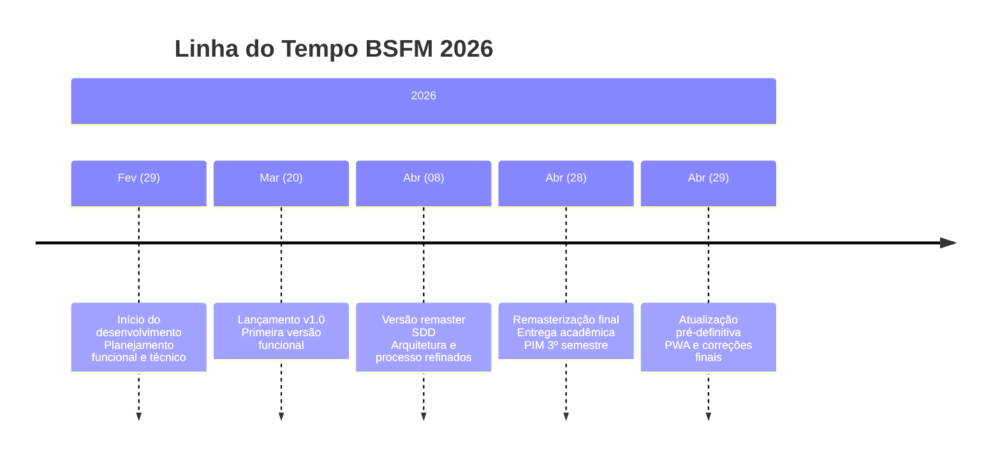

# Roadmap BSFM

Este documento apresenta o plano de desenvolvimento do **BSFM (Brazilian System of Food Metric)**. O roadmap é um documento vivo que reflete as metas e objetivos do projeto acadêmico.

---

## Linha do Tempo Real

## Fase Atual: Protótipo Acadêmico (2026)

### Fevereiro/2026 - Início do Projeto ✅
**Status:** Concluído

#### Atividades Realizadas
- Definição do tema da ONG de nutrição
- Criação do grupo no WhatsApp para comunicação
- Divisão das tarefas entre os 4 integrantes
- Planejamento dos RF (Requisitos Funcionais) e RNF (Requisitos Não Funcionais)
- Identificação dos Stakeholders
- Definição dos termos de contrato

### Março/2026 - Primeira Versão Funcional ✅
**Status:** Concluído

#### Entregas
- Backend .NET 8.0 com rotas de API
- Sistema de cadastro e login
- Dashboard com métricas básicas
- Análise de alimentos por IA (YOLO)
- Integração com USDA API

### Abril/2026 - Remasterização Final ✅
**Status:** Concluído em 28/04/2026

#### Entregas da Remasterização
- Consumo de água (registro diário/semanal)
- Plano de refeições semanal
- Perfil do usuário (edição de dados)
- Gráficos de evolução (Chart.js)
- Mapa SOS Saúde (Leaflet)
- Central LIBRAS
- Refatoração do tema (light-mode)
- Animações e melhorias de UI/UX
- Configuração de deploy no Render
- Documentação revisada e transparente

### Abril/2026 - Atualização Pré-Definitiva ✅
**Status:** Concluído em 29/04/2026

#### Entregas da Atualização
- **PWA (Progressive Web App)**: Aplicação instalável em dispositivos móveis
- **Service Worker**: Cache offline com estratégia network-first
- **Ícone SVG do BSFM**: Logotipo otimizado para PWA
- **Meta tags PWA**: Adicionadas em todas as páginas HTML
- **Documentação MkDocs atualizada**: Conteúdo realista de protótipo
- **Correção de navegação**: Links rápidos da home page corrigidos
- **Paleta de cores ajustada**: Barra de navegação preta com detalhes em laranja

---

## Metas Futuras (Timeline de Desenvolvimento)

As metas abaixo representam os **objetivos almejados** para o futuro do projeto, caso o desenvolvimento continue após a entrega acadêmica:

### Curto Prazo (Próximos Meses)
- [ ] **Melhorar precisão da IA**: Treinar modelo YOLO com mais alimentos brasileiros
- [ ] **Modo escuro (dark mode)**: Implementar toggle de tema
- [ ] **Notificações toast**: Substituir alerts por notificações elegantes
- [ ] **Exportação de dados**: Gerar PDF/CSV do plano alimentar
- [x] **PWA**: Tornar a plataforma instalável em dispositivos móveis
- [ ] **Gráficos de macros**: Evolução de proteínas, carboidratos e gorduras
- [ ] **Sistema de conquistas**: Badges de progresso para motivar usuários

### Médio Prazo
- [ ] **App mobile**: Versão nativa para iOS e Android
- [ ] **Reconhecimento automático de porções**: IA que estima tamanho das porções
- [ ] **Integração com wearables**: Apple Health, Google Fit
- [ ] **Notificações push**: Lembretes de refeições e hidratação
- [ ] **Planos alimentares gerados por IA**: Cardápios personalizados automáticos

### Longo Prazo (Visão do Projeto)
- [ ] **API pública**: Disponibilizar endpoints para desenvolvedores
- [ ] **Marketplace de profissionais**: Conectar nutricionistas e usuários
- [ ] **Integração com SUS**: Conectividade com sistemas públicos de saúde
- [ ] **Modo offline**: Funcionalidade completa sem internet
- [ ] **Expansão internacional**: Adaptação para outros países

---

## Como Contribuir para o Roadmap

### Para Usuários do Protótipo
1. **Teste a plataforma** e reporte bugs encontrados
2. **Sugira novas funcionalidades** que seriam úteis
3. **Compartilhe feedback** sobre a experiência de uso

### Para Desenvolvedores
1. **Contribua com código** no repositório do projeto
2. **Reporte issues** no GitHub
3. **Sugira melhorias** de arquitetura e performance

---

## Processo de Atualização do Roadmap

### Ciclo de Revisão
- **Semanal**: Ajustes baseados em feedback imediato
- **Mensal**: Revisão de metas e prioridades
- **Por entrega**: Atualização completa a cada versão

### Critérios de Priorização
1. **Valor acadêmico**: Contribui para o aprendizado da equipe?
2. **Viabilidade técnica**: É possível implementar com os recursos atuais?
3. **Impacto no usuário**: Melhora significativamente a experiência?
4. **Complexidade**: Pode ser implementado dentro do prazo?

---

**Última atualização:** 29 de Abril de 2026  
**Mantido por:** Equipe BSFM - UNIP
